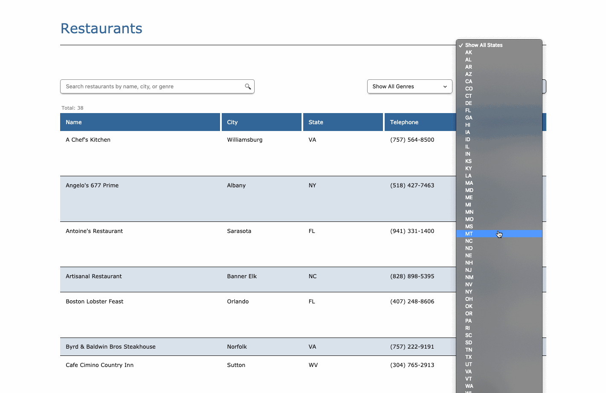

# Restaurant List

Restaurant List is a web application that pulls restaurant data from a simple API, displays that data in a table, and allows users to search, filter, and paginate through the list.



## Production Build

Visit: https://restaurant-list-2cb09.web.app/

## Built With

- ReactJS (ES6+, Hooks/Functional)
- CSS (Grid and Flex)


#### Setup

1. Navigate to the preferred local directory where your project will reside.

2. Clone the following repository:
```
https://github.com/bee-squared/restaurant_list
```

3. Run the following commands:
```
$ npm install
$ npm start
```

## Author

Brian Bouchard
- [Github Profile](https://github.com/bee-squared)
- [LinkedIn Profile](https://www.linkedin.com/in/brian-bouchard/)
- [Project Portfolio](https://www.b-squared.life/)